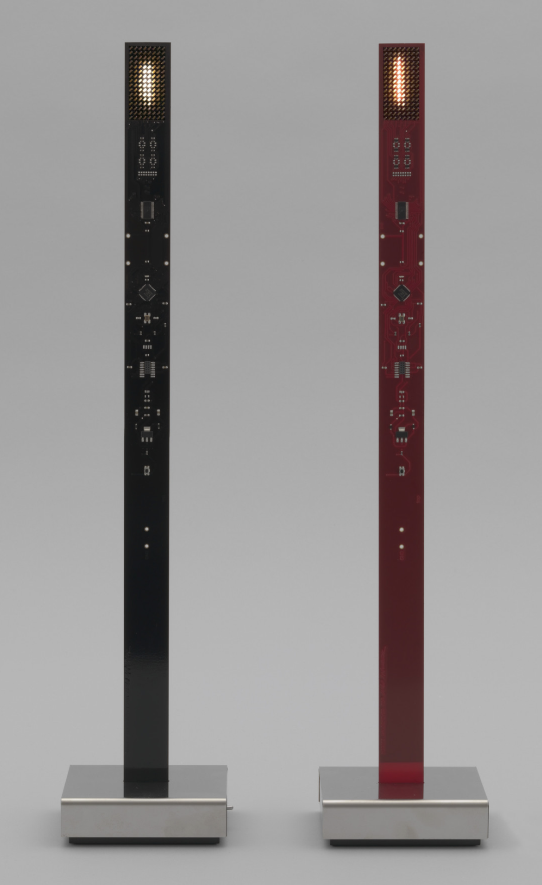
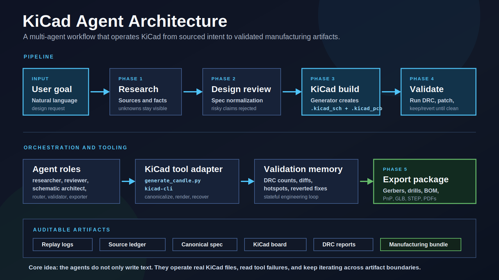

# KiCad Agent Pipeline

> A multi-agent workflow that operates KiCad end to end: research a physical product, review and normalize the spec, generate the board, repair design-rule failures, and export fabrication files.



This project was built for the GOSIM Paris 2026 Agentic AI Hackathon. The target is a recreation-inspired PCB for Ingo Maurer's **My New Flame** lamp: a tall, narrow 430x30mm board with two LED faces, a stem/base interface, and manufacturable KiCad outputs.

The key idea is not "LLM writes a PCB once." The system keeps an auditable chain of agents around KiCad: source-gathering, claim review, spec branching, deterministic board generation, DRC repair, and fabrication export. The demo UI replays the real agent logs and KiCad artifacts so judges can see where agents made decisions, caught mistakes, and recovered from failed fixes.

---

## Why This Matters

Hardware design is a good stress test for agentic AI because plausible text is not enough. A wrong charger IC, incorrect LED topology, or broken clearance rule becomes a real manufacturing problem. This project shows agents doing the work around the artifact:

- reading source material before creating a spec
- rejecting unsupported or electrically invalid claims
- refusing to build a blocked faithful reconstruction
- branching to a buildable modernized target
- generating KiCad schematic/PCB files
- running automated DRC loops until the board reaches zero violations
- exporting Gerbers, drill files, BOM, placement CSV, and a 3D model

The result is a working local demo plus a complete KiCad hardware project that reviewers can inspect directly.

---

## Demo Flow

Run the local replay UI and press **Play**. The app shows six screens: an overview, then the five pipeline phases.

| Phase | What reviewers see | Why it matters |
|---|---|---|
| 0. Overview | KiCad context and project goal | Frames the real EDA environment, not just a mock UI |
| 1. Research | Sources, facts, unresolved questions, source previews, terminal log | Shows source discipline before design work starts |
| 2. Design | Multi-agent review, rejected claims, branch selection | Shows self-correction and refusal to guess |
| 3. Build | KiCad component groups and generated board structure | Shows the system moving from spec to concrete PCB artifacts |
| 4. Validate | DRC loop, improvements, regressions, reverts, final zero-violation state | Shows agents reading tool feedback and recovering from failures |
| 5. Export | Fabrication bundle, individual files, spinning GLB board preview | Shows manufacturing-ready outputs |

The required 3-5 minute demo video is supplied through the hackathon submission. This repository contains the local demo used to produce that video.

---

## Judging Criteria Fit

**Innovation:** The project treats KiCad as an agent-operable engineering environment. Agents do not only draft text; they inspect evidence, branch specs, run tools, measure failures, and decide when not to proceed.

**Technical depth:** The repo includes a real KiCad 10 project, replay logs, a React/Vite provenance UI, custom KiCad automation scripts, DRC recovery outputs, fabrication files, and a 3D GLB preview.

**Completeness:** The demo covers the whole path from research to export. The hardware project includes `.kicad_pro`, `.kicad_sch`, `.kicad_pcb`, custom footprints, Gerbers, drill files, BOM, position CSV, PDFs, STEP/GLB, and DRC reports.

**Practicality:** The workflow targets a real engineering failure mode: AI systems that hallucinate hardware details and stop before validation. This pipeline makes uncertainty visible and closes the loop with KiCad checks.

**Presentation:** The UI is a deterministic replay of the pipeline, with phase-by-phase controls and visual artifacts for judges to follow in a 3 minute live demo.

---

## Agentic Moments

**Phase 2: self-correction**

- A reviewer agent rejects the proposed MCP73871 charger IC because it is a single-cell Li-Ion charger, while the original target uses 4x AA NiMH cells.
- A design-research agent corrects the claim that the LEDs are physically flame-shaped. Source evidence shows an 8x16 rectangular LED field per face; the flame is rendered by animation.
- The system refuses to build the faithful reconstruction while charger topology remains unresolved, then selects the `v5_modernized` branch as the build target.

**Phase 4: failure recovery**

- DRC starts at 451 violations and reaches 0 after 33 iterations.
- Some proposed fixes improve the board and are kept.
- Some fixes make the DRC count worse and are reverted.
- Later fixes can succeed after earlier routing context changes, showing that the validation loop is state-aware rather than a static checklist.

---

## Run Locally

Requirements:

- Node.js 20+
- npm
- A modern browser

Start the demo:

```bash
cd kicad-agent-ui/frontend
npm install
npm run dev
```

Open:

```text
http://localhost:5173/
```

Build the frontend:

```bash
cd kicad-agent-ui/frontend
npm run build
```

The frontend is self-contained for demo playback. KiCad is not required to run the replay UI, but the hardware files can be opened in KiCad 10 for inspection.

---

## Repository Map

```text
.
├── agents/                         # Agent role prompts and responsibilities
├── examples/                       # Example user prompts for faithful and modernized builds
├── hardware/
│   ├── README.md                   # Hardware artifact notes
│   ├── candle-git-history.bundle   # Preserved original candle project history
│   └── candle/                     # Full KiCad project and generated outputs
├── kicad-agent-ui/
│   ├── backend/                    # FastAPI skeleton for project/pipeline/viewer APIs
│   └── frontend/                   # React/Vite replay UI
├── replays/                        # Canonical NDJSON phase replay logs
├── DEMO.md                         # Demo/provenance notes
├── DISCLOSURE.md                   # Pre-existing vs hackathon-built disclosure
├── SUBMISSION.md                   # Hackathon metadata checklist
└── README.md
```

---

## Hardware Artifacts

The complete KiCad project is in [hardware/candle](hardware/candle).

Key source files:

- [hardware/candle/candle.kicad_pro](hardware/candle/candle.kicad_pro)
- [hardware/candle/candle.kicad_sch](hardware/candle/candle.kicad_sch)
- [hardware/candle/candle.kicad_pcb](hardware/candle/candle.kicad_pcb)
- [hardware/candle/candle.pretty](hardware/candle/candle.pretty)
- [hardware/candle/tools/generate_candle.py](hardware/candle/tools/generate_candle.py)
- [hardware/candle/tools/candle_recovery.py](hardware/candle/tools/candle_recovery.py)
- [hardware/candle/outputs/fabrication](hardware/candle/outputs/fabrication)
- [hardware/candle/outputs/candle.glb](hardware/candle/outputs/candle.glb)

The frontend also serves compact demo copies from:

- [kicad-agent-ui/frontend/public/replays](kicad-agent-ui/frontend/public/replays)
- [kicad-agent-ui/frontend/public/exports/candle](kicad-agent-ui/frontend/public/exports/candle)

Fabrication outputs include:

- front/back copper Gerbers
- two internal copper layers
- solder mask and silkscreen
- edge cuts
- plated and non-plated drill files
- assembly BOM
- position CSV
- fabrication ZIP
- GLB 3D model

---

## Architecture



[Open the architecture diagram](docs/architecture-diagram.svg).

[PNG version](docs/architecture-diagram.png).

```text
User goal
   |
   v
Research agent
   |-- sources consulted
   |-- tagged fact ledger
   |-- unresolved questions
   v
Design review agents
   |-- spec normalizer
   |-- electrical reviewer
   |-- design researcher
   |-- critic
   v
Build agents
   |-- schematic architect
   |-- spec-to-schematic
   |-- placement planner
   |-- route strategist
   v
KiCad automation
   |-- generate_candle.py
   |-- kicad-cli
   |-- canonicalize/stabilize tools
   v
Validation agents
   |-- run DRC
   |-- inspect violations
   |-- patch board
   |-- measure delta
   |-- revert or keep
   v
Export agent
   |-- Gerbers
   |-- drills
   |-- BOM / position CSV
   |-- GLB / STEP
```

---

## Technology

- **EDA:** KiCad 10.0, `kicad-cli`
- **Automation:** Python 3.9 scripts for generation, canonicalization, rendering, DRC experiments, and recovery
- **Frontend:** React 19, TypeScript, Vite
- **Backend:** FastAPI skeleton for project, pipeline, and viewer routes
- **Demo data:** NDJSON replay logs and static KiCad export artifacts
- **Target board:** 430x30mm 4-layer PCB, 256 LEDs, ATtiny1616, 2x IS31FL3731-QF, custom footprints

---

## Pre-Existing vs Hackathon Work

| Pre-existing / carried in | Built or assembled for the hackathon submission |
|---|---|
| Original candle KiCad project and generator history | Public repo structure and preserved hardware bundle |
| Research/spec session artifacts | Five-phase replay model and demo UI |
| DRC reduction history | Validation visualization and provenance narrative |
| KiCad CLI/tooling experiments | Submission-focused docs, phase script, and export preview |

Full disclosure is in [DISCLOSURE.md](DISCLOSURE.md).

---

## Verification

Reviewers can verify the work through:

- [replays](replays): phase-by-phase replay logs
- [hardware/candle/outputs/recovery](hardware/candle/outputs/recovery): DRC recovery reports and summaries
- [hardware/candle/outputs/fabrication](hardware/candle/outputs/fabrication): manufacturing outputs
- [hardware/candle/outputs/docs](hardware/candle/outputs/docs): exported schematic and board PDFs
- [hardware/candle-git-history.bundle](hardware/candle-git-history.bundle): original project history bundle
- [DEMO.md](DEMO.md): demo/provenance notes
- [DISCLOSURE.md](DISCLOSURE.md): scope and provenance disclosure

---

## License

[MIT](LICENSE)

---

*GOSIM Paris 2026 — Agentic AI Hackathon*
